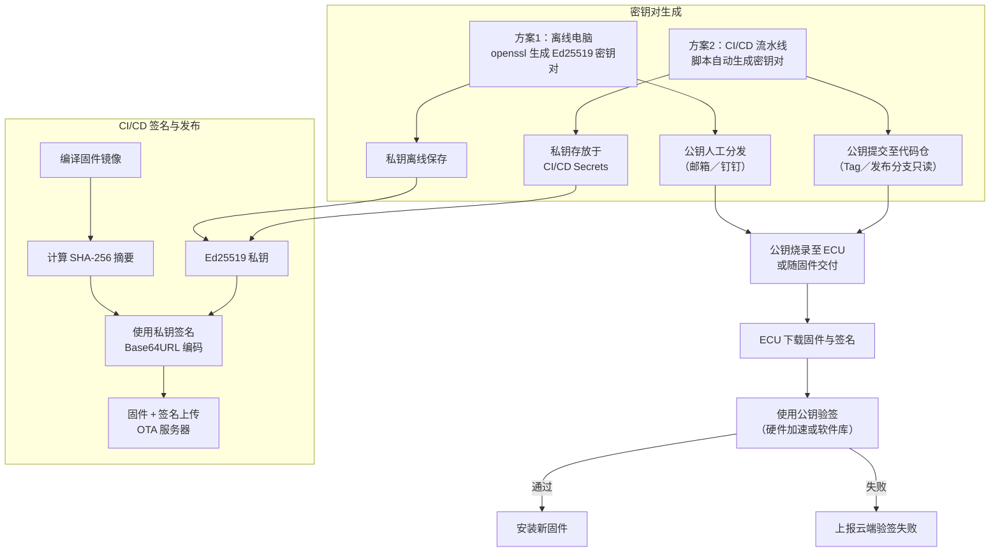

香港运输署要求：

![](data:image/svg+xml;base64,PHN2ZyBhcmlhLXJvbGVkZXNjcmlwdGlvbj0iZmxvd2NoYXJ0LXYyIiByb2xlPSJncmFwaGljcy1kb2N1bWVudCBkb2N1bWVudCIgdmlld0JveD0iLTggLTggMTI0OC40NzI2NTYyNSA3ODIuMjUiIHN0eWxlPSJtYXgtd2lkdGg6IDEyNDguNDcyNjU2MjVweDsiIHhtbG5zOnhsaW5rPSJodHRwOi8vd3d3LnczLm9yZy8xOTk5L3hsaW5rIiB4bWxucz0iaHR0cDovL3d3dy53My5vcmcvMjAwMC9zdmciICBpZD0idGV4dC1kaWFncmFtLWNkZWQ0N2Q4LTg5NDAtNGVlZS04YjNiLWVlZGE3NzkxMTkwMy05MDAyMiIgd2lkdGg9IjEyNDguNDcyNjU2MjUiIGhlaWdodD0iNzgyLjI1Ij48c3R5bGU+I3RleHQtZGlhZ3JhbS1jZGVkNDdkOC04OTQwLTRlZWUtOGIzYi1lZWRhNzc5MTE5MDMtOTAwMjJ7Zm9udC1mYW1pbHk6InRyZWJ1Y2hldCBtcyIsdmVyZGFuYSxhcmlhbCxzYW5zLXNlcmlmO2ZvbnQtc2l6ZToxNnB4O2ZpbGw6IzMzMzt9I3RleHQtZGlhZ3JhbS1jZGVkNDdkOC04OTQwLTRlZWUtOGIzYi1lZWRhNzc5MTE5MDMtOTAwMjIgLmVycm9yLWljb257ZmlsbDojNTUyMjIyO30jdGV4dC1kaWFncmFtLWNkZWQ0N2Q4LTg5NDAtNGVlZS04YjNiLWVlZGE3NzkxMTkwMy05MDAyMiAuZXJyb3ItdGV4dHtmaWxsOiM1NTIyMjI7c3Ryb2tlOiM1NTIyMjI7fSN0ZXh0LWRpYWdyYW0tY2RlZDQ3ZDgtODk0MC00ZWVlLThiM2ItZWVkYTc3OTExOTAzLTkwMDIyIC5lZGdlLXRoaWNrbmVzcy1ub3JtYWx7c3Ryb2tlLXdpZHRoOjJweDt9I3RleHQtZGlhZ3JhbS1jZGVkNDdkOC04OTQwLTRlZWUtOGIzYi1lZWRhNzc5MTE5MDMtOTAwMjIgLmVkZ2UtdGhpY2tuZXNzLXRoaWNre3N0cm9rZS13aWR0aDozLjVweDt9I3RleHQtZGlhZ3JhbS1jZGVkNDdkOC04OTQwLTRlZWUtOGIzYi1lZWRhNzc5MTE5MDMtOTAwMjIgLmVkZ2UtcGF0dGVybi1zb2xpZHtzdHJva2UtZGFzaGFycmF5OjA7fSN0ZXh0LWRpYWdyYW0tY2RlZDQ3ZDgtODk0MC00ZWVlLThiM2ItZWVkYTc3OTExOTAzLTkwMDIyIC5lZGdlLXBhdHRlcm4tZGFzaGVke3N0cm9rZS1kYXNoYXJyYXk6Mzt9I3RleHQtZGlhZ3JhbS1jZGVkNDdkOC04OTQwLTRlZWUtOGIzYi1lZWRhNzc5MTE5MDMtOTAwMjIgLmVkZ2UtcGF0dGVybi1kb3R0ZWR7c3Ryb2tlLWRhc2hhcnJheToyO30jdGV4dC1kaWFncmFtLWNkZWQ0N2Q4LTg5NDAtNGVlZS04YjNiLWVlZGE3NzkxMTkwMy05MDAyMiAubWFya2Vye2ZpbGw6IzMzMzMzMztzdHJva2U6IzMzMzMzMzt9I3RleHQtZGlhZ3JhbS1jZGVkNDdkOC04OTQwLTRlZWUtOGIzYi1lZWRhNzc5MTE5MDMtOTAwMjIgLm1hcmtlci5jcm9zc3tzdHJva2U6IzMzMzMzMzt9I3RleHQtZGlhZ3JhbS1jZGVkNDdkOC04OTQwLTRlZWUtOGIzYi1lZWRhNzc5MTE5MDMtOTAwMjIgc3Zne2ZvbnQtZmFtaWx5OiJ0cmVidWNoZXQgbXMiLHZlcmRhbmEsYXJpYWwsc2Fucy1zZXJpZjtmb250LXNpemU6MTZweDt9I3RleHQtZGlhZ3JhbS1jZGVkNDdkOC04OTQwLTRlZWUtOGIzYi1lZWRhNzc5MTE5MDMtOTAwMjIgLmxhYmVse2ZvbnQtZmFtaWx5OiJ0cmVidWNoZXQgbXMiLHZlcmRhbmEsYXJpYWwsc2Fucy1zZXJpZjtjb2xvcjojMzMzO30jdGV4dC1kaWFncmFtLWNkZWQ0N2Q4LTg5NDAtNGVlZS04YjNiLWVlZGE3NzkxMTkwMy05MDAyMiAuY2x1c3Rlci1sYWJlbCB0ZXh0e2ZpbGw6IzMzMzt9I3RleHQtZGlhZ3JhbS1jZGVkNDdkOC04OTQwLTRlZWUtOGIzYi1lZWRhNzc5MTE5MDMtOTAwMjIgLmNsdXN0ZXItbGFiZWwgc3BhbiwjdGV4dC1kaWFncmFtLWNkZWQ0N2Q4LTg5NDAtNGVlZS04YjNiLWVlZGE3NzkxMTkwMy05MDAyMiBwe2NvbG9yOiMzMzM7fSN0ZXh0LWRpYWdyYW0tY2RlZDQ3ZDgtODk0MC00ZWVlLThiM2ItZWVkYTc3OTExOTAzLTkwMDIyIC5sYWJlbCB0ZXh0LCN0ZXh0LWRpYWdyYW0tY2RlZDQ3ZDgtODk0MC00ZWVlLThiM2ItZWVkYTc3OTExOTAzLTkwMDIyIHNwYW4sI3RleHQtZGlhZ3JhbS1jZGVkNDdkOC04OTQwLTRlZWUtOGIzYi1lZWRhNzc5MTE5MDMtOTAwMjIgcHtmaWxsOiMzMzM7Y29sb3I6IzMzMzt9I3RleHQtZGlhZ3JhbS1jZGVkNDdkOC04OTQwLTRlZWUtOGIzYi1lZWRhNzc5MTE5MDMtOTAwMjIgLm5vZGUgcmVjdCwjdGV4dC1kaWFncmFtLWNkZWQ0N2Q4LTg5NDAtNGVlZS04YjNiLWVlZGE3NzkxMTkwMy05MDAyMiAubm9kZSBjaXJjbGUsI3RleHQtZGlhZ3JhbS1jZGVkNDdkOC04OTQwLTRlZWUtOGIzYi1lZWRhNzc5MTE5MDMtOTAwMjIgLm5vZGUgZWxsaXBzZSwjdGV4dC1kaWFncmFtLWNkZWQ0N2Q4LTg5NDAtNGVlZS04YjNiLWVlZGE3NzkxMTkwMy05MDAyMiAubm9kZSBwb2x5Z29uLCN0ZXh0LWRpYWdyYW0tY2RlZDQ3ZDgtODk0MC00ZWVlLThiM2ItZWVkYTc3OTExOTAzLTkwMDIyIC5ub2RlIHBhdGh7ZmlsbDojRUNFQ0ZGO3N0cm9rZTojOTM3MERCO3N0cm9rZS13aWR0aDoxcHg7fSN0ZXh0LWRpYWdyYW0tY2RlZDQ3ZDgtODk0MC00ZWVlLThiM2ItZWVkYTc3OTExOTAzLTkwMDIyIC5mbG93Y2hhcnQtbGFiZWwgdGV4dHt0ZXh0LWFuY2hvcjptaWRkbGU7fSN0ZXh0LWRpYWdyYW0tY2RlZDQ3ZDgtODk0MC00ZWVlLThiM2ItZWVkYTc3OTExOTAzLTkwMDIyIC5ub2RlIC5rYXRleCBwYXRoe2ZpbGw6IzAwMDtzdHJva2U6IzAwMDtzdHJva2Utd2lkdGg6MXB4O30jdGV4dC1kaWFncmFtLWNkZWQ0N2Q4LTg5NDAtNGVlZS04YjNiLWVlZGE3NzkxMTkwMy05MDAyMiAubm9kZSAubGFiZWx7dGV4dC1hbGlnbjpjZW50ZXI7fSN0ZXh0LWRpYWdyYW0tY2RlZDQ3ZDgtODk0MC00ZWVlLThiM2ItZWVkYTc3OTExOTAzLTkwMDIyIC5ub2RlLmNsaWNrYWJsZXtjdXJzb3I6cG9pbnRlcjt9I3RleHQtZGlhZ3JhbS1jZGVkNDdkOC04OTQwLTRlZWUtOGIzYi1lZWRhNzc5MTE5MDMtOTAwMjIgLmFycm93aGVhZFBhdGh7ZmlsbDojMzMzMzMzO30jdGV4dC1kaWFncmFtLWNkZWQ0N2Q4LTg5NDAtNGVlZS04YjNiLWVlZGE3NzkxMTkwMy05MDAyMiAuZWRnZVBhdGggLnBhdGh7c3Ryb2tlOiMzMzMzMzM7c3Ryb2tlLXdpZHRoOjIuMHB4O30jdGV4dC1kaWFncmFtLWNkZWQ0N2Q4LTg5NDAtNGVlZS04YjNiLWVlZGE3NzkxMTkwMy05MDAyMiAuZmxvd2NoYXJ0LWxpbmt7c3Ryb2tlOiMzMzMzMzM7ZmlsbDpub25lO30jdGV4dC1kaWFncmFtLWNkZWQ0N2Q4LTg5NDAtNGVlZS04YjNiLWVlZGE3NzkxMTkwMy05MDAyMiAuZWRnZUxhYmVse2JhY2tncm91bmQtY29sb3I6I2U4ZThlODt0ZXh0LWFsaWduOmNlbnRlcjt9I3RleHQtZGlhZ3JhbS1jZGVkNDdkOC04OTQwLTRlZWUtOGIzYi1lZWRhNzc5MTE5MDMtOTAwMjIgLmVkZ2VMYWJlbCByZWN0e29wYWNpdHk6MC41O2JhY2tncm91bmQtY29sb3I6I2U4ZThlODtmaWxsOiNlOGU4ZTg7fSN0ZXh0LWRpYWdyYW0tY2RlZDQ3ZDgtODk0MC00ZWVlLThiM2ItZWVkYTc3OTExOTAzLTkwMDIyIC5sYWJlbEJrZ3tiYWNrZ3JvdW5kLWNvbG9yOnJnYmEoMjMyLCAyMzIsIDIzMiwgMC41KTt9I3RleHQtZGlhZ3JhbS1jZGVkNDdkOC04OTQwLTRlZWUtOGIzYi1lZWRhNzc5MTE5MDMtOTAwMjIgLmNsdXN0ZXIgcmVjdHtmaWxsOiNmZmZmZGU7c3Ryb2tlOiNhYWFhMzM7c3Ryb2tlLXdpZHRoOjFweDt9I3RleHQtZGlhZ3JhbS1jZGVkNDdkOC04OTQwLTRlZWUtOGIzYi1lZWRhNzc5MTE5MDMtOTAwMjIgLmNsdXN0ZXIgdGV4dHtmaWxsOiMzMzM7fSN0ZXh0LWRpYWdyYW0tY2RlZDQ3ZDgtODk0MC00ZWVlLThiM2ItZWVkYTc3OTExOTAzLTkwMDIyIC5jbHVzdGVyIHNwYW4sI3RleHQtZGlhZ3JhbS1jZGVkNDdkOC04OTQwLTRlZWUtOGIzYi1lZWRhNzc5MTE5MDMtOTAwMjIgcHtjb2xvcjojMzMzO30jdGV4dC1kaWFncmFtLWNkZWQ0N2Q4LTg5NDAtNGVlZS04YjNiLWVlZGE3NzkxMTkwMy05MDAyMiBkaXYubWVybWFpZFRvb2x0aXB7cG9zaXRpb246YWJzb2x1dGU7dGV4dC1hbGlnbjpjZW50ZXI7bWF4LXdpZHRoOjIwMHB4O3BhZGRpbmc6MnB4O2ZvbnQtZmFtaWx5OiJ0cmVidWNoZXQgbXMiLHZlcmRhbmEsYXJpYWwsc2Fucy1zZXJpZjtmb250LXNpemU6MTJweDtiYWNrZ3JvdW5kOmhzbCg4MCwgMTAwJSwgOTYuMjc0NTA5ODAzOSUpO2JvcmRlcjoxcHggc29saWQgI2FhYWEzMztib3JkZXItcmFkaXVzOjJweDtwb2ludGVyLWV2ZW50czpub25lO3otaW5kZXg6MTAwO30jdGV4dC1kaWFncmFtLWNkZWQ0N2Q4LTg5NDAtNGVlZS04YjNiLWVlZGE3NzkxMTkwMy05MDAyMiAuZmxvd2NoYXJ0VGl0bGVUZXh0e3RleHQtYW5jaG9yOm1pZGRsZTtmb250LXNpemU6MThweDtmaWxsOiMzMzM7fSN0ZXh0LWRpYWdyYW0tY2RlZDQ3ZDgtODk0MC00ZWVlLThiM2ItZWVkYTc3OTExOTAzLTkwMDIyIDpyb290ey0tbWVybWFpZC1mb250LWZhbWlseToidHJlYnVjaGV0IG1zIix2ZXJkYW5hLGFyaWFsLHNhbnMtc2VyaWY7fTwvc3R5bGU+PGc+PG1hcmtlciBvcmllbnQ9ImF1dG8iIG1hcmtlckhlaWdodD0iMTIiIG1hcmtlcldpZHRoPSIxMiIgbWFya2VyVW5pdHM9InVzZXJTcGFjZU9uVXNlIiByZWZZPSI1IiByZWZYPSI2IiB2aWV3Qm94PSIwIDAgMTAgMTAiIGNsYXNzPSJtYXJrZXIgZmxvd2NoYXJ0IiBpZD0idGV4dC1kaWFncmFtLWNkZWQ0N2Q4LTg5NDAtNGVlZS04YjNiLWVlZGE3NzkxMTkwMy05MDAyMl9mbG93Y2hhcnQtcG9pbnRFbmQiPjxwYXRoIHN0eWxlPSJzdHJva2Utd2lkdGg6IDE7IHN0cm9rZS1kYXNoYXJyYXk6IDEsIDA7IiBjbGFzcz0iYXJyb3dNYXJrZXJQYXRoIiBkPSJNIDAgMCBMIDEwIDUgTCAwIDEwIHoiPjwvcGF0aD48L21hcmtlcj48bWFya2VyIG9yaWVudD0iYXV0byIgbWFya2VySGVpZ2h0PSIxMiIgbWFya2VyV2lkdGg9IjEyIiBtYXJrZXJVbml0cz0idXNlclNwYWNlT25Vc2UiIHJlZlk9IjUiIHJlZlg9IjQuNSIgdmlld0JveD0iMCAwIDEwIDEwIiBjbGFzcz0ibWFya2VyIGZsb3djaGFydCIgaWQ9InRleHQtZGlhZ3JhbS1jZGVkNDdkOC04OTQwLTRlZWUtOGIzYi1lZWRhNzc5MTE5MDMtOTAwMjJfZmxvd2NoYXJ0LXBvaW50U3RhcnQiPjxwYXRoIHN0eWxlPSJzdHJva2Utd2lkdGg6IDE7IHN0cm9rZS1kYXNoYXJyYXk6IDEsIDA7IiBjbGFzcz0iYXJyb3dNYXJrZXJQYXRoIiBkPSJNIDAgNSBMIDEwIDEwIEwgMTAgMCB6Ij48L3BhdGg+PC9tYXJrZXI+PG1hcmtlciBvcmllbnQ9ImF1dG8iIG1hcmtlckhlaWdodD0iMTEiIG1hcmtlcldpZHRoPSIxMSIgbWFya2VyVW5pdHM9InVzZXJTcGFjZU9uVXNlIiByZWZZPSI1IiByZWZYPSIxMSIgdmlld0JveD0iMCAwIDEwIDEwIiBjbGFzcz0ibWFya2VyIGZsb3djaGFydCIgaWQ9InRleHQtZGlhZ3JhbS1jZGVkNDdkOC04OTQwLTRlZWUtOGIzYi1lZWRhNzc5MTE5MDMtOTAwMjJfZmxvd2NoYXJ0LWNpcmNsZUVuZCI+PGNpcmNsZSBzdHlsZT0ic3Ryb2tlLXdpZHRoOiAxOyBzdHJva2UtZGFzaGFycmF5OiAxLCAwOyIgY2xhc3M9ImFycm93TWFya2VyUGF0aCIgcj0iNSIgY3k9IjUiIGN4PSI1Ij48L2NpcmNsZT48L21hcmtlcj48bWFya2VyIG9yaWVudD0iYXV0byIgbWFya2VySGVpZ2h0PSIxMSIgbWFya2VyV2lkdGg9IjExIiBtYXJrZXJVbml0cz0idXNlclNwYWNlT25Vc2UiIHJlZlk9IjUiIHJlZlg9Ii0xIiB2aWV3Qm94PSIwIDAgMTAgMTAiIGNsYXNzPSJtYXJrZXIgZmxvd2NoYXJ0IiBpZD0idGV4dC1kaWFncmFtLWNkZWQ0N2Q4LTg5NDAtNGVlZS04YjNiLWVlZGE3NzkxMTkwMy05MDAyMl9mbG93Y2hhcnQtY2lyY2xlU3RhcnQiPjxjaXJjbGUgc3R5bGU9InN0cm9rZS13aWR0aDogMTsgc3Ryb2tlLWRhc2hhcnJheTogMSwgMDsiIGNsYXNzPSJhcnJvd01hcmtlclBhdGgiIHI9IjUiIGN5PSI1IiBjeD0iNSI+PC9jaXJjbGU+PC9tYXJrZXI+PG1hcmtlciBvcmllbnQ9ImF1dG8iIG1hcmtlckhlaWdodD0iMTEiIG1hcmtlcldpZHRoPSIxMSIgbWFya2VyVW5pdHM9InVzZXJTcGFjZU9uVXNlIiByZWZZPSI1LjIiIHJlZlg9IjEyIiB2aWV3Qm94PSIwIDAgMTEgMTEiIGNsYXNzPSJtYXJrZXIgY3Jvc3MgZmxvd2NoYXJ0IiBpZD0idGV4dC1kaWFncmFtLWNkZWQ0N2Q4LTg5NDAtNGVlZS04YjNiLWVlZGE3NzkxMTkwMy05MDAyMl9mbG93Y2hhcnQtY3Jvc3NFbmQiPjxwYXRoIHN0eWxlPSJzdHJva2Utd2lkdGg6IDI7IHN0cm9rZS1kYXNoYXJyYXk6IDEsIDA7IiBjbGFzcz0iYXJyb3dNYXJrZXJQYXRoIiBkPSJNIDEsMSBsIDksOSBNIDEwLDEgbCAtOSw5Ij48L3BhdGg+PC9tYXJrZXI+PG1hcmtlciBvcmllbnQ9ImF1dG8iIG1hcmtlckhlaWdodD0iMTEiIG1hcmtlcldpZHRoPSIxMSIgbWFya2VyVW5pdHM9InVzZXJTcGFjZU9uVXNlIiByZWZZPSI1LjIiIHJlZlg9Ii0xIiB2aWV3Qm94PSIwIDAgMTEgMTEiIGNsYXNzPSJtYXJrZXIgY3Jvc3MgZmxvd2NoYXJ0IiBpZD0idGV4dC1kaWFncmFtLWNkZWQ0N2Q4LTg5NDAtNGVlZS04YjNiLWVlZGE3NzkxMTkwMy05MDAyMl9mbG93Y2hhcnQtY3Jvc3NTdGFydCI+PHBhdGggc3R5bGU9InN0cm9rZS13aWR0aDogMjsgc3Ryb2tlLWRhc2hhcnJheTogMSwgMDsiIGNsYXNzPSJhcnJvd01hcmtlclBhdGgiIGQ9Ik0gMSwxIGwgOSw5IE0gMTAsMSBsIC05LDkiPjwvcGF0aD48L21hcmtlcj48ZyBjbGFzcz0icm9vdCI+PGcgY2xhc3M9ImNsdXN0ZXJzIj48ZyBpZD0iU2lnbmluZ1JlbGVhc2UiIGNsYXNzPSJjbHVzdGVyIGRlZmF1bHQgZmxvd2NoYXJ0LWxhYmVsIj48cmVjdCBoZWlnaHQ9IjUwMi41IiB3aWR0aD0iMzc1LjYyODkwNjI1IiB5PSIxNDQuMzc1IiB4PSIwIiByeT0iMCIgcng9IjAiIHN0eWxlPSIiPjwvcmVjdD48ZyB0cmFuc2Zvcm09InRyYW5zbGF0ZSgxMjUuNzA1MDc4MTI1LCAxNDQuMzc1KSIgY2xhc3M9ImNsdXN0ZXItbGFiZWwiPjxmb3JlaWduT2JqZWN0IGhlaWdodD0iMjcuMTg3NSIgd2lkdGg9IjEyNC4yMTg3NSI+PGRpdiBzdHlsZT0iZGlzcGxheTogaW5saW5lLWJsb2NrOyB3aGl0ZS1zcGFjZTogbm93cmFwOyIgeG1sbnM9Imh0dHA6Ly93d3cudzMub3JnLzE5OTkveGh0bWwiPjxzcGFuIGNsYXNzPSJub2RlTGFiZWwiPkNJL0NE4oCv562+5ZCN5LiO5Y+R5biDPC9zcGFuPjwvZGl2PjwvZm9yZWlnbk9iamVjdD48L2c+PC9nPjxnIGlkPSJLZXlwYWlyR2VuZXJhdGlvbiIgY2xhc3M9ImNsdXN0ZXIgZGVmYXVsdCBmbG93Y2hhcnQtbGFiZWwiPjxyZWN0IGhlaWdodD0iMjYzLjc1IiB3aWR0aD0iODM2Ljg0Mzc1IiB5PSIwIiB4PSIzOTUuNjI4OTA2MjUiIHJ5PSIwIiByeD0iMCIgc3R5bGU9IiI+PC9yZWN0PjxnIHRyYW5zZm9ybT0idHJhbnNsYXRlKDc3NC4wNTA3ODEyNSwgMCkiIGNsYXNzPSJjbHVzdGVyLWxhYmVsIj48Zm9yZWlnbk9iamVjdCBoZWlnaHQ9IjI3LjE4NzUiIHdpZHRoPSI4MCI+PGRpdiBzdHlsZT0iZGlzcGxheTogaW5saW5lLWJsb2NrOyB3aGl0ZS1zcGFjZTogbm93cmFwOyIgeG1sbnM9Imh0dHA6Ly93d3cudzMub3JnLzE5OTkveGh0bWwiPjxzcGFuIGNsYXNzPSJub2RlTGFiZWwiPuWvhumSpeWvueeUn+aIkDwvc3Bhbj48L2Rpdj48L2ZvcmVpZ25PYmplY3Q+PC9nPjwvZz48L2c+PGcgY2xhc3M9ImVkZ2VQYXRocyI+PHBhdGggbWFya2VyLWVuZD0idXJsKCN0ZXh0LWRpYWdyYW0tY2RlZDQ3ZDgtODk0MC00ZWVlLThiM2ItZWVkYTc3OTExOTAzLTkwMDIyX2Zsb3djaGFydC1wb2ludEVuZCkiIHN0eWxlPSJmaWxsOm5vbmU7IiBjbGFzcz0iZWRnZS10aGlja25lc3Mtbm9ybWFsIGVkZ2UtcGF0dGVybi1zb2xpZCBmbG93Y2hhcnQtbGluayBMUy1PZmZsaW5lIExFLU9mZmxpbmVQcml2IiBpZD0iTC1PZmZsaW5lLU9mZmxpbmVQcml2LTAiIGQ9Ik01ODEuNzM3LDk0LjM3NUw1NzAuMjA3LDk4LjU0MkM1NTguNjc4LDEwMi43MDgsNTM1LjYxOCwxMTEuMDQyLDUyNC4wODgsMTE5LjM3NUM1MTIuNTU5LDEyNy43MDgsNTEyLjU1OSwxMzYuMDQyLDUxMi41NTksMTQ1Ljc1N0M1MTIuNTU5LDE1NS40NzMsNTEyLjU1OSwxNjYuNTcxLDUxMi41NTksMTcyLjEyTDUxMi41NTksMTc3LjY2OSI+PC9wYXRoPjxwYXRoIG1hcmtlci1lbmQ9InVybCgjdGV4dC1kaWFncmFtLWNkZWQ0N2Q4LTg5NDAtNGVlZS04YjNiLWVlZGE3NzkxMTkwMy05MDAyMl9mbG93Y2hhcnQtcG9pbnRFbmQpIiBzdHlsZT0iZmlsbDpub25lOyIgY2xhc3M9ImVkZ2UtdGhpY2tuZXNzLW5vcm1hbCBlZGdlLXBhdHRlcm4tc29saWQgZmxvd2NoYXJ0LWxpbmsgTFMtT2ZmbGluZSBMRS1PZmZsaW5lUHViIiBpZD0iTC1PZmZsaW5lLU9mZmxpbmVQdWItMCIgZD0iTTc4Ni4wODIsOTEuMTk2TDgwMi4yMzMsOTUuODkzQzgxOC4zODQsMTAwLjU4OSw4NTAuNjg2LDEwOS45ODIsODY2LjgzNywxMTguODQ1Qzg4Mi45ODgsMTI3LjcwOCw4ODIuOTg4LDEzNi4wNDIsODgyLjk4OCwxNDMuNDkyQzg4Mi45ODgsMTUwLjk0Miw4ODIuOTg4LDE1Ny41MDgsODgyLjk4OCwxNjAuNzkyTDg4Mi45ODgsMTY0LjA3NSI+PC9wYXRoPjxwYXRoIG1hcmtlci1lbmQ9InVybCgjdGV4dC1kaWFncmFtLWNkZWQ0N2Q4LTg5NDAtNGVlZS04YjNiLWVlZGE3NzkxMTkwMy05MDAyMl9mbG93Y2hhcnQtcG9pbnRFbmQpIiBzdHlsZT0iZmlsbDpub25lOyIgY2xhc3M9ImVkZ2UtdGhpY2tuZXNzLW5vcm1hbCBlZGdlLXBhdHRlcm4tc29saWQgZmxvd2NoYXJ0LWxpbmsgTFMtQ0kgTEUtQ0lQcml2IiBpZD0iTC1DSS1DSVByaXYtMCIgZD0iTTgzNi4wODIsODMuODI1TDgxNS43MDYsODkuNzVDNzk1LjMyOSw5NS42NzUsNzU0LjU3NywxMDcuNTI1LDczNC4yMDEsMTE3LjYxN0M3MTMuODI0LDEyNy43MDgsNzEzLjgyNCwxMzYuMDQyLDcxMy44MjQsMTQzLjQ5MkM3MTMuODI0LDE1MC45NDIsNzEzLjgyNCwxNTcuNTA4LDcxMy44MjQsMTYwLjc5Mkw3MTMuODI0LDE2NC4wNzUiPjwvcGF0aD48cGF0aCBtYXJrZXItZW5kPSJ1cmwoI3RleHQtZGlhZ3JhbS1jZGVkNDdkOC04OTQwLTRlZWUtOGIzYi1lZWRhNzc5MTE5MDMtOTAwMjJfZmxvd2NoYXJ0LXBvaW50RW5kKSIgc3R5bGU9ImZpbGw6bm9uZTsiIGNsYXNzPSJlZGdlLXRoaWNrbmVzcy1ub3JtYWwgZWRnZS1wYXR0ZXJuLXNvbGlkIGZsb3djaGFydC1saW5rIExTLUNJIExFLUNJUHViIiBpZD0iTC1DSS1DSVB1Yi0wIiBkPSJNMTAwMi4wOTgsODYuMThMMTAxOS40MzIsOTEuNzEzQzEwMzYuNzY3LDk3LjI0NSwxMDcxLjQzNiwxMDguMzEsMTA4OC43NzEsMTE4LjAwOUMxMTA2LjEwNSwxMjcuNzA4LDExMDYuMTA1LDEzNi4wNDIsMTEwNi4xMDUsMTQzLjQ5MkMxMTA2LjEwNSwxNTAuOTQyLDExMDYuMTA1LDE1Ny41MDgsMTEwNi4xMDUsMTYwLjc5MkwxMTA2LjEwNSwxNjQuMDc1Ij48L3BhdGg+PHBhdGggbWFya2VyLWVuZD0idXJsKCN0ZXh0LWRpYWdyYW0tY2RlZDQ3ZDgtODk0MC00ZWVlLThiM2ItZWVkYTc3OTExOTAzLTkwMDIyX2Zsb3djaGFydC1wb2ludEVuZCkiIHN0eWxlPSJmaWxsOm5vbmU7IiBjbGFzcz0iZWRnZS10aGlja25lc3Mtbm9ybWFsIGVkZ2UtcGF0dGVybi1zb2xpZCBmbG93Y2hhcnQtbGluayBMUy1PZmZsaW5lUHJpdiBMRS1TZWNyZXRzIiBpZD0iTC1PZmZsaW5lUHJpdi1TZWNyZXRzLTAiIGQ9Ik01MTIuNTU5LDIyNS4xNTZMNTEyLjU1OSwyMzEuNTg5QzUxMi41NTksMjM4LjAyMSw1MTIuNTU5LDI1MC44ODUsNDYxLjE0MywyNjEuNDg0QzQwOS43MjgsMjcyLjA4MywzMDYuODk3LDI4MC40MTcsMjYzLjE2OCwyOTAuNDc4QzIxOS40NCwzMDAuNTQsMjM0LjgxMywzMTIuMzI5LDI0Mi41LDMxOC4yMjRMMjUwLjE4NywzMjQuMTE5Ij48L3BhdGg+PHBhdGggbWFya2VyLWVuZD0idXJsKCN0ZXh0LWRpYWdyYW0tY2RlZDQ3ZDgtODk0MC00ZWVlLThiM2ItZWVkYTc3OTExOTAzLTkwMDIyX2Zsb3djaGFydC1wb2ludEVuZCkiIHN0eWxlPSJmaWxsOm5vbmU7IiBjbGFzcz0iZWRnZS10aGlja25lc3Mtbm9ybWFsIGVkZ2UtcGF0dGVybi1zb2xpZCBmbG93Y2hhcnQtbGluayBMUy1DSVByaXYgTEUtU2VjcmV0cyIgaWQ9IkwtQ0lQcml2LVNlY3JldHMtMCIgZD0iTTcxMy44MjQsMjM4Ljc1TDcxMy44MjQsMjQyLjkxN0M3MTMuODI0LDI0Ny4wODMsNzEzLjgyNCwyNTUuNDE3LDY0Ny42MjIsMjYzLjc1QzU4MS40MjEsMjcyLjA4Myw0NDkuMDE3LDI4MC40MTcsMzc5LjUxOCwyOTAuMjUyQzMxMC4wMTksMzAwLjA4NywzMDMuNDI1LDMxMS40MjUsMzAwLjEyOCwzMTcuMDk0TDI5Ni44MzEsMzIyLjc2MiI+PC9wYXRoPjxwYXRoIG1hcmtlci1lbmQ9InVybCgjdGV4dC1kaWFncmFtLWNkZWQ0N2Q4LTg5NDAtNGVlZS04YjNiLWVlZGE3NzkxMTkwMy05MDAyMl9mbG93Y2hhcnQtcG9pbnRFbmQpIiBzdHlsZT0iZmlsbDpub25lOyIgY2xhc3M9ImVkZ2UtdGhpY2tuZXNzLW5vcm1hbCBlZGdlLXBhdHRlcm4tc29saWQgZmxvd2NoYXJ0LWxpbmsgTFMtT2ZmbGluZVB1YiBMRS1GbGFzaCIgaWQ9IkwtT2ZmbGluZVB1Yi1GbGFzaC0wIiBkPSJNODgyLjk4OCwyMzguNzVMODgyLjk4OCwyNDIuOTE3Qzg4Mi45ODgsMjQ3LjA4Myw4ODIuOTg4LDI1NS40MTcsODgyLjk4OCwyNjMuNzVDODgyLjk4OCwyNzIuMDgzLDg4Mi45ODgsMjgwLjQxNyw4OTEuODE2LDI4OC45NDlDOTAwLjY0MywyOTcuNDgyLDkxOC4yOTgsMzA2LjIxMyw5MjcuMTI1LDMxMC41NzlMOTM1Ljk1MiwzMTQuOTQ1Ij48L3BhdGg+PHBhdGggbWFya2VyLWVuZD0idXJsKCN0ZXh0LWRpYWdyYW0tY2RlZDQ3ZDgtODk0MC00ZWVlLThiM2ItZWVkYTc3OTExOTAzLTkwMDIyX2Zsb3djaGFydC1wb2ludEVuZCkiIHN0eWxlPSJmaWxsOm5vbmU7IiBjbGFzcz0iZWRnZS10aGlja25lc3Mtbm9ybWFsIGVkZ2UtcGF0dGVybi1zb2xpZCBmbG93Y2hhcnQtbGluayBMUy1DSVB1YiBMRS1GbGFzaCIgaWQ9IkwtQ0lQdWItRmxhc2gtMCIgZD0iTTExMDYuMTA1LDIzOC43NUwxMTA2LjEwNSwyNDIuOTE3QzExMDYuMTA1LDI0Ny4wODMsMTEwNi4xMDUsMjU1LjQxNywxMTA2LjEwNSwyNjMuNzVDMTEwNi4xMDUsMjcyLjA4MywxMTA2LjEwNSwyODAuNDE3LDEwOTkuNzE4LDI4OC4zMDVDMTA5My4zMzEsMjk2LjE5NCwxMDgwLjU1NiwzMDMuNjM4LDEwNzQuMTY4LDMwNy4zNkwxMDY3Ljc4MSwzMTEuMDgyIj48L3BhdGg+PHBhdGggbWFya2VyLWVuZD0idXJsKCN0ZXh0LWRpYWdyYW0tY2RlZDQ3ZDgtODk0MC00ZWVlLThiM2ItZWVkYTc3OTExOTAzLTkwMDIyX2Zsb3djaGFydC1wb2ludEVuZCkiIHN0eWxlPSJmaWxsOm5vbmU7IiBjbGFzcz0iZWRnZS10aGlja25lc3Mtbm9ybWFsIGVkZ2UtcGF0dGVybi1zb2xpZCBmbG93Y2hhcnQtbGluayBMUy1CdWlsZCBMRS1IYXNoIiBpZD0iTC1CdWlsZC1IYXNoLTAiIGQ9Ik0xMDYuMjM0LDIyNS4xNTZMMTA2LjIzNCwyMzEuNTg5QzEwNi4yMzQsMjM4LjAyMSwxMDYuMjM0LDI1MC44ODUsMTA2LjIzNCwyNjEuNDg0QzEwNi4yMzQsMjcyLjA4MywxMDYuMjM0LDI4MC40MTcsMTA2LjIzNCwyOTAuMTMyQzEwNi4yMzQsMjk5Ljg0OCwxMDYuMjM0LDMxMC45NDYsMTA2LjIzNCwzMTYuNDk1TDEwNi4yMzQsMzIyLjA0NCI+PC9wYXRoPjxwYXRoIG1hcmtlci1lbmQ9InVybCgjdGV4dC1kaWFncmFtLWNkZWQ0N2Q4LTg5NDAtNGVlZS04YjNiLWVlZGE3NzkxMTkwMy05MDAyMl9mbG93Y2hhcnQtcG9pbnRFbmQpIiBzdHlsZT0iZmlsbDpub25lOyIgY2xhc3M9ImVkZ2UtdGhpY2tuZXNzLW5vcm1hbCBlZGdlLXBhdHRlcm4tc29saWQgZmxvd2NoYXJ0LWxpbmsgTFMtSGFzaCBMRS1TaWduIiBpZD0iTC1IYXNoLVNpZ24tMCIgZD0iTTEwNi4yMzQsMzY5LjUzMUwxMDYuMjM0LDM3NS45NjRDMTA2LjIzNCwzODIuMzk2LDEwNi4yMzQsMzk1LjI2LDExMS42MzUsNDA1LjM2M0MxMTcuMDM2LDQxNS40NjUsMTI3LjgzNyw0MjIuODA2LDEzMy4yMzgsNDI2LjQ3NkwxMzguNjM5LDQzMC4xNDYiPjwvcGF0aD48cGF0aCBtYXJrZXItZW5kPSJ1cmwoI3RleHQtZGlhZ3JhbS1jZGVkNDdkOC04OTQwLTRlZWUtOGIzYi1lZWRhNzc5MTE5MDMtOTAwMjJfZmxvd2NoYXJ0LXBvaW50RW5kKSIgc3R5bGU9ImZpbGw6bm9uZTsiIGNsYXNzPSJlZGdlLXRoaWNrbmVzcy1ub3JtYWwgZWRnZS1wYXR0ZXJuLXNvbGlkIGZsb3djaGFydC1saW5rIExTLVNlY3JldHMgTEUtU2lnbiIgaWQ9IkwtU2VjcmV0cy1TaWduLTAiIGQ9Ik0yODEuODk4LDM2OS41MzFMMjgxLjg5OCwzNzUuOTY0QzI4MS44OTgsMzgyLjM5NiwyODEuODk4LDM5NS4yNiwyNzYuNDk4LDQwNS4zNjNDMjcxLjA5Nyw0MTUuNDY1LDI2MC4yOTUsNDIyLjgwNiwyNTQuODk1LDQyNi40NzZMMjQ5LjQ5NCw0MzAuMTQ2Ij48L3BhdGg+PHBhdGggbWFya2VyLWVuZD0idXJsKCN0ZXh0LWRpYWdyYW0tY2RlZDQ3ZDgtODk0MC00ZWVlLThiM2ItZWVkYTc3OTExOTAzLTkwMDIyX2Zsb3djaGFydC1wb2ludEVuZCkiIHN0eWxlPSJmaWxsOm5vbmU7IiBjbGFzcz0iZWRnZS10aGlja25lc3Mtbm9ybWFsIGVkZ2UtcGF0dGVybi1zb2xpZCBmbG93Y2hhcnQtbGluayBMUy1TaWduIExFLVVwbG9hZCIgaWQ9IkwtU2lnbi1VcGxvYWQtMCIgZD0iTTE5NC4wNjYsNTAyLjVMMTk0LjA2Niw1MDYuNjY3QzE5NC4wNjYsNTEwLjgzMywxOTQuMDY2LDUxOS4xNjcsMTk0LjA2Niw1MjYuNjE3QzE5NC4wNjYsNTM0LjA2NywxOTQuMDY2LDU0MC42MzMsMTk0LjA2Niw1NDMuOTE3TDE5NC4wNjYsNTQ3LjIiPjwvcGF0aD48cGF0aCBtYXJrZXItZW5kPSJ1cmwoI3RleHQtZGlhZ3JhbS1jZGVkNDdkOC04OTQwLTRlZWUtOGIzYi1lZWRhNzc5MTE5MDMtOTAwMjJfZmxvd2NoYXJ0LXBvaW50RW5kKSIgc3R5bGU9ImZpbGw6bm9uZTsiIGNsYXNzPSJlZGdlLXRoaWNrbmVzcy1ub3JtYWwgZWRnZS1wYXR0ZXJuLXNvbGlkIGZsb3djaGFydC1saW5rIExTLUZsYXNoIExFLURvd25sb2FkIiBpZD0iTC1GbGFzaC1Eb3dubG9hZC0wIiBkPSJNMTAwMy42NzIsMzgzLjEyNUwxMDAzLjY3MiwzODcuMjkyQzEwMDMuNjcyLDM5MS40NTgsMTAwMy42NzIsMzk5Ljc5MiwxMDAzLjY3Miw0MDkuNTA3QzEwMDMuNjcyLDQxOS4yMjMsMTAwMy42NzIsNDMwLjMyMSwxMDAzLjY3Miw0MzUuODdMMTAwMy42NzIsNDQxLjQxOSI+PC9wYXRoPjxwYXRoIG1hcmtlci1lbmQ9InVybCgjdGV4dC1kaWFncmFtLWNkZWQ0N2Q4LTg5NDAtNGVlZS04YjNiLWVlZGE3NzkxMTkwMy05MDAyMl9mbG93Y2hhcnQtcG9pbnRFbmQpIiBzdHlsZT0iZmlsbDpub25lOyIgY2xhc3M9ImVkZ2UtdGhpY2tuZXNzLW5vcm1hbCBlZGdlLXBhdHRlcm4tc29saWQgZmxvd2NoYXJ0LWxpbmsgTFMtRG93bmxvYWQgTEUtVmVyaWZ5IiBpZD0iTC1Eb3dubG9hZC1WZXJpZnktMCIgZD0iTTEwMDMuNjcyLDQ4OC45MDZMMTAwMy42NzIsNDk1LjMzOUMxMDAzLjY3Miw1MDEuNzcxLDEwMDMuNjcyLDUxNC42MzUsMTAwMy42NzIsNTI0LjM1MUMxMDAzLjY3Miw1MzQuMDY3LDEwMDMuNjcyLDU0MC42MzMsMTAwMy42NzIsNTQzLjkxN0wxMDAzLjY3Miw1NDcuMiI+PC9wYXRoPjxwYXRoIG1hcmtlci1lbmQ9InVybCgjdGV4dC1kaWFncmFtLWNkZWQ0N2Q4LTg5NDAtNGVlZS04YjNiLWVlZGE3NzkxMTkwMy05MDAyMl9mbG93Y2hhcnQtcG9pbnRFbmQpIiBzdHlsZT0iZmlsbDpub25lOyIgY2xhc3M9ImVkZ2UtdGhpY2tuZXNzLW5vcm1hbCBlZGdlLXBhdHRlcm4tc29saWQgZmxvd2NoYXJ0LWxpbmsgTFMtVmVyaWZ5IExFLUluc3RhbGwiIGlkPSJMLVZlcmlmeS1JbnN0YWxsLTAiIGQ9Ik05MTYuMTcyLDYwMi45NjFMODc1LjU3Miw2MTAuMjhDODM0Ljk3Myw2MTcuNTk5LDc1My43NzMsNjMyLjIzNyw3MTMuMTc0LDY0NS45ODhDNjcyLjU3NCw2NTkuNzQsNjcyLjU3NCw2NzIuNjA0LDY3Mi41NzQsNjg0LjU4NUM2NzIuNTc0LDY5Ni41NjcsNjcyLjU3NCw3MDcuNjY1LDY3Mi41NzQsNzEzLjIxNEw2NzIuNTc0LDcxOC43NjMiPjwvcGF0aD48cGF0aCBtYXJrZXItZW5kPSJ1cmwoI3RleHQtZGlhZ3JhbS1jZGVkNDdkOC04OTQwLTRlZWUtOGIzYi1lZWRhNzc5MTE5MDMtOTAwMjJfZmxvd2NoYXJ0LXBvaW50RW5kKSIgc3R5bGU9ImZpbGw6bm9uZTsiIGNsYXNzPSJlZGdlLXRoaWNrbmVzcy1ub3JtYWwgZWRnZS1wYXR0ZXJuLXNvbGlkIGZsb3djaGFydC1saW5rIExTLVZlcmlmeSBMRS1SZXBvcnQiIGlkPSJMLVZlcmlmeS1SZXBvcnQtMCIgZD0iTTEwNTIuNzc5LDYyMS44NzVMMTA1OC42NzgsNjI2LjA0MkMxMDY0LjU3Nyw2MzAuMjA4LDEwNzYuMzc0LDYzOC41NDIsMTA4Mi4yNzMsNjQ5LjE0MUMxMDg4LjE3Miw2NTkuNzQsMTA4OC4xNzIsNjcyLjYwNCwxMDg4LjE3Miw2ODQuNTg1QzEwODguMTcyLDY5Ni41NjcsMTA4OC4xNzIsNzA3LjY2NSwxMDg4LjE3Miw3MTMuMjE0TDEwODguMTcyLDcxOC43NjMiPjwvcGF0aD48L2c+PGcgY2xhc3M9ImVkZ2VMYWJlbHMiPjxnIGNsYXNzPSJlZGdlTGFiZWwiPjxnIHRyYW5zZm9ybT0idHJhbnNsYXRlKDAsIDApIiBjbGFzcz0ibGFiZWwiPjxmb3JlaWduT2JqZWN0IGhlaWdodD0iMCIgd2lkdGg9IjAiPjxkaXYgc3R5bGU9ImRpc3BsYXk6IGlubGluZS1ibG9jazsgd2hpdGUtc3BhY2U6IG5vd3JhcDsiIHhtbG5zPSJodHRwOi8vd3d3LnczLm9yZy8xOTk5L3hodG1sIj48c3BhbiBjbGFzcz0iZWRnZUxhYmVsIj48L3NwYW4+PC9kaXY+PC9mb3JlaWduT2JqZWN0PjwvZz48L2c+PGcgY2xhc3M9ImVkZ2VMYWJlbCI+PGcgdHJhbnNmb3JtPSJ0cmFuc2xhdGUoMCwgMCkiIGNsYXNzPSJsYWJlbCI+PGZvcmVpZ25PYmplY3QgaGVpZ2h0PSIwIiB3aWR0aD0iMCI+PGRpdiBzdHlsZT0iZGlzcGxheTogaW5saW5lLWJsb2NrOyB3aGl0ZS1zcGFjZTogbm93cmFwOyIgeG1sbnM9Imh0dHA6Ly93d3cudzMub3JnLzE5OTkveGh0bWwiPjxzcGFuIGNsYXNzPSJlZGdlTGFiZWwiPjwvc3Bhbj48L2Rpdj48L2ZvcmVpZ25PYmplY3Q+PC9nPjwvZz48ZyBjbGFzcz0iZWRnZUxhYmVsIj48ZyB0cmFuc2Zvcm09InRyYW5zbGF0ZSgwLCAwKSIgY2xhc3M9ImxhYmVsIj48Zm9yZWlnbk9iamVjdCBoZWlnaHQ9IjAiIHdpZHRoPSIwIj48ZGl2IHN0eWxlPSJkaXNwbGF5OiBpbmxpbmUtYmxvY2s7IHdoaXRlLXNwYWNlOiBub3dyYXA7IiB4bWxucz0iaHR0cDovL3d3dy53My5vcmcvMTk5OS94aHRtbCI+PHNwYW4gY2xhc3M9ImVkZ2VMYWJlbCI+PC9zcGFuPjwvZGl2PjwvZm9yZWlnbk9iamVjdD48L2c+PC9nPjxnIGNsYXNzPSJlZGdlTGFiZWwiPjxnIHRyYW5zZm9ybT0idHJhbnNsYXRlKDAsIDApIiBjbGFzcz0ibGFiZWwiPjxmb3JlaWduT2JqZWN0IGhlaWdodD0iMCIgd2lkdGg9IjAiPjxkaXYgc3R5bGU9ImRpc3BsYXk6IGlubGluZS1ibG9jazsgd2hpdGUtc3BhY2U6IG5vd3JhcDsiIHhtbG5zPSJodHRwOi8vd3d3LnczLm9yZy8xOTk5L3hodG1sIj48c3BhbiBjbGFzcz0iZWRnZUxhYmVsIj48L3NwYW4+PC9kaXY+PC9mb3JlaWduT2JqZWN0PjwvZz48L2c+PGcgY2xhc3M9ImVkZ2VMYWJlbCI+PGcgdHJhbnNmb3JtPSJ0cmFuc2xhdGUoMCwgMCkiIGNsYXNzPSJsYWJlbCI+PGZvcmVpZ25PYmplY3QgaGVpZ2h0PSIwIiB3aWR0aD0iMCI+PGRpdiBzdHlsZT0iZGlzcGxheTogaW5saW5lLWJsb2NrOyB3aGl0ZS1zcGFjZTogbm93cmFwOyIgeG1sbnM9Imh0dHA6Ly93d3cudzMub3JnLzE5OTkveGh0bWwiPjxzcGFuIGNsYXNzPSJlZGdlTGFiZWwiPjwvc3Bhbj48L2Rpdj48L2ZvcmVpZ25PYmplY3Q+PC9nPjwvZz48ZyBjbGFzcz0iZWRnZUxhYmVsIj48ZyB0cmFuc2Zvcm09InRyYW5zbGF0ZSgwLCAwKSIgY2xhc3M9ImxhYmVsIj48Zm9yZWlnbk9iamVjdCBoZWlnaHQ9IjAiIHdpZHRoPSIwIj48ZGl2IHN0eWxlPSJkaXNwbGF5OiBpbmxpbmUtYmxvY2s7IHdoaXRlLXNwYWNlOiBub3dyYXA7IiB4bWxucz0iaHR0cDovL3d3dy53My5vcmcvMTk5OS94aHRtbCI+PHNwYW4gY2xhc3M9ImVkZ2VMYWJlbCI+PC9zcGFuPjwvZGl2PjwvZm9yZWlnbk9iamVjdD48L2c+PC9nPjxnIGNsYXNzPSJlZGdlTGFiZWwiPjxnIHRyYW5zZm9ybT0idHJhbnNsYXRlKDAsIDApIiBjbGFzcz0ibGFiZWwiPjxmb3JlaWduT2JqZWN0IGhlaWdodD0iMCIgd2lkdGg9IjAiPjxkaXYgc3R5bGU9ImRpc3BsYXk6IGlubGluZS1ibG9jazsgd2hpdGUtc3BhY2U6IG5vd3JhcDsiIHhtbG5zPSJodHRwOi8vd3d3LnczLm9yZy8xOTk5L3hodG1sIj48c3BhbiBjbGFzcz0iZWRnZUxhYmVsIj48L3NwYW4+PC9kaXY+PC9mb3JlaWduT2JqZWN0PjwvZz48L2c+PGcgY2xhc3M9ImVkZ2VMYWJlbCI+PGcgdHJhbnNmb3JtPSJ0cmFuc2xhdGUoMCwgMCkiIGNsYXNzPSJsYWJlbCI+PGZvcmVpZ25PYmplY3QgaGVpZ2h0PSIwIiB3aWR0aD0iMCI+PGRpdiBzdHlsZT0iZGlzcGxheTogaW5saW5lLWJsb2NrOyB3aGl0ZS1zcGFjZTogbm93cmFwOyIgeG1sbnM9Imh0dHA6Ly93d3cudzMub3JnLzE5OTkveGh0bWwiPjxzcGFuIGNsYXNzPSJlZGdlTGFiZWwiPjwvc3Bhbj48L2Rpdj48L2ZvcmVpZ25PYmplY3Q+PC9nPjwvZz48ZyBjbGFzcz0iZWRnZUxhYmVsIj48ZyB0cmFuc2Zvcm09InRyYW5zbGF0ZSgwLCAwKSIgY2xhc3M9ImxhYmVsIj48Zm9yZWlnbk9iamVjdCBoZWlnaHQ9IjAiIHdpZHRoPSIwIj48ZGl2IHN0eWxlPSJkaXNwbGF5OiBpbmxpbmUtYmxvY2s7IHdoaXRlLXNwYWNlOiBub3dyYXA7IiB4bWxucz0iaHR0cDovL3d3dy53My5vcmcvMTk5OS94aHRtbCI+PHNwYW4gY2xhc3M9ImVkZ2VMYWJlbCI+PC9zcGFuPjwvZGl2PjwvZm9yZWlnbk9iamVjdD48L2c+PC9nPjxnIGNsYXNzPSJlZGdlTGFiZWwiPjxnIHRyYW5zZm9ybT0idHJhbnNsYXRlKDAsIDApIiBjbGFzcz0ibGFiZWwiPjxmb3JlaWduT2JqZWN0IGhlaWdodD0iMCIgd2lkdGg9IjAiPjxkaXYgc3R5bGU9ImRpc3BsYXk6IGlubGluZS1ibG9jazsgd2hpdGUtc3BhY2U6IG5vd3JhcDsiIHhtbG5zPSJodHRwOi8vd3d3LnczLm9yZy8xOTk5L3hodG1sIj48c3BhbiBjbGFzcz0iZWRnZUxhYmVsIj48L3NwYW4+PC9kaXY+PC9mb3JlaWduT2JqZWN0PjwvZz48L2c+PGcgY2xhc3M9ImVkZ2VMYWJlbCI+PGcgdHJhbnNmb3JtPSJ0cmFuc2xhdGUoMCwgMCkiIGNsYXNzPSJsYWJlbCI+PGZvcmVpZ25PYmplY3QgaGVpZ2h0PSIwIiB3aWR0aD0iMCI+PGRpdiBzdHlsZT0iZGlzcGxheTogaW5saW5lLWJsb2NrOyB3aGl0ZS1zcGFjZTogbm93cmFwOyIgeG1sbnM9Imh0dHA6Ly93d3cudzMub3JnLzE5OTkveGh0bWwiPjxzcGFuIGNsYXNzPSJlZGdlTGFiZWwiPjwvc3Bhbj48L2Rpdj48L2ZvcmVpZ25PYmplY3Q+PC9nPjwvZz48ZyBjbGFzcz0iZWRnZUxhYmVsIj48ZyB0cmFuc2Zvcm09InRyYW5zbGF0ZSgwLCAwKSIgY2xhc3M9ImxhYmVsIj48Zm9yZWlnbk9iamVjdCBoZWlnaHQ9IjAiIHdpZHRoPSIwIj48ZGl2IHN0eWxlPSJkaXNwbGF5OiBpbmxpbmUtYmxvY2s7IHdoaXRlLXNwYWNlOiBub3dyYXA7IiB4bWxucz0iaHR0cDovL3d3dy53My5vcmcvMTk5OS94aHRtbCI+PHNwYW4gY2xhc3M9ImVkZ2VMYWJlbCI+PC9zcGFuPjwvZGl2PjwvZm9yZWlnbk9iamVjdD48L2c+PC9nPjxnIGNsYXNzPSJlZGdlTGFiZWwiPjxnIHRyYW5zZm9ybT0idHJhbnNsYXRlKDAsIDApIiBjbGFzcz0ibGFiZWwiPjxmb3JlaWduT2JqZWN0IGhlaWdodD0iMCIgd2lkdGg9IjAiPjxkaXYgc3R5bGU9ImRpc3BsYXk6IGlubGluZS1ibG9jazsgd2hpdGUtc3BhY2U6IG5vd3JhcDsiIHhtbG5zPSJodHRwOi8vd3d3LnczLm9yZy8xOTk5L3hodG1sIj48c3BhbiBjbGFzcz0iZWRnZUxhYmVsIj48L3NwYW4+PC9kaXY+PC9mb3JlaWduT2JqZWN0PjwvZz48L2c+PGcgY2xhc3M9ImVkZ2VMYWJlbCI+PGcgdHJhbnNmb3JtPSJ0cmFuc2xhdGUoMCwgMCkiIGNsYXNzPSJsYWJlbCI+PGZvcmVpZ25PYmplY3QgaGVpZ2h0PSIwIiB3aWR0aD0iMCI+PGRpdiBzdHlsZT0iZGlzcGxheTogaW5saW5lLWJsb2NrOyB3aGl0ZS1zcGFjZTogbm93cmFwOyIgeG1sbnM9Imh0dHA6Ly93d3cudzMub3JnLzE5OTkveGh0bWwiPjxzcGFuIGNsYXNzPSJlZGdlTGFiZWwiPjwvc3Bhbj48L2Rpdj48L2ZvcmVpZ25PYmplY3Q+PC9nPjwvZz48ZyB0cmFuc2Zvcm09InRyYW5zbGF0ZSg2NzIuNTc0MjE4NzUsIDY4NS40Njg3NSkiIGNsYXNzPSJlZGdlTGFiZWwiPjxnIHRyYW5zZm9ybT0idHJhbnNsYXRlKC0xNiwgLTEzLjU5Mzc1KSIgY2xhc3M9ImxhYmVsIj48Zm9yZWlnbk9iamVjdCBoZWlnaHQ9IjI3LjE4NzUiIHdpZHRoPSIzMiI+PGRpdiBzdHlsZT0iZGlzcGxheTogaW5saW5lLWJsb2NrOyB3aGl0ZS1zcGFjZTogbm93cmFwOyIgeG1sbnM9Imh0dHA6Ly93d3cudzMub3JnLzE5OTkveGh0bWwiPjxzcGFuIGNsYXNzPSJlZGdlTGFiZWwiPumAmui/hzwvc3Bhbj48L2Rpdj48L2ZvcmVpZ25PYmplY3Q+PC9nPjwvZz48ZyB0cmFuc2Zvcm09InRyYW5zbGF0ZSgxMDg4LjE3MTg3NSwgNjg1LjQ2ODc1KSIgY2xhc3M9ImVkZ2VMYWJlbCI+PGcgdHJhbnNmb3JtPSJ0cmFuc2xhdGUoLTE2LCAtMTMuNTkzNzUpIiBjbGFzcz0ibGFiZWwiPjxmb3JlaWduT2JqZWN0IGhlaWdodD0iMjcuMTg3NSIgd2lkdGg9IjMyIj48ZGl2IHN0eWxlPSJkaXNwbGF5OiBpbmxpbmUtYmxvY2s7IHdoaXRlLXNwYWNlOiBub3dyYXA7IiB4bWxucz0iaHR0cDovL3d3dy53My5vcmcvMTk5OS94aHRtbCI+PHNwYW4gY2xhc3M9ImVkZ2VMYWJlbCI+5aSx6LSlPC9zcGFuPjwvZGl2PjwvZm9yZWlnbk9iamVjdD48L2c+PC9nPjwvZz48ZyBjbGFzcz0ibm9kZXMiPjxnIHRyYW5zZm9ybT0idHJhbnNsYXRlKDEwNi4yMzQzNzUsIDM0OC40Mzc1KSIgZGF0YS1pZD0iSGFzaCIgZGF0YS1ub2RlPSJ0cnVlIiBpZD0iZmxvd2NoYXJ0LUhhc2gtMTkiIGNsYXNzPSJub2RlIGRlZmF1bHQgZGVmYXVsdCBmbG93Y2hhcnQtbGFiZWwiPjxyZWN0IGhlaWdodD0iNDIuMTg3NSIgd2lkdGg9IjE0Mi40Njg3NSIgeT0iLTIxLjA5Mzc1IiB4PSItNzEuMjM0Mzc1IiByeT0iMCIgcng9IjAiIHN0eWxlPSIiIGNsYXNzPSJiYXNpYyBsYWJlbC1jb250YWluZXIiPjwvcmVjdD48ZyB0cmFuc2Zvcm09InRyYW5zbGF0ZSgtNjMuNzM0Mzc1LCAtMTMuNTkzNzUpIiBzdHlsZT0iIiBjbGFzcz0ibGFiZWwiPjxyZWN0PjwvcmVjdD48Zm9yZWlnbk9iamVjdCBoZWlnaHQ9IjI3LjE4NzUiIHdpZHRoPSIxMjcuNDY4NzUiPjxkaXYgc3R5bGU9ImRpc3BsYXk6IGlubGluZS1ibG9jazsgd2hpdGUtc3BhY2U6IG5vd3JhcDsiIHhtbG5zPSJodHRwOi8vd3d3LnczLm9yZy8xOTk5L3hodG1sIj48c3BhbiBjbGFzcz0ibm9kZUxhYmVsIj7orqHnrpfigK9TSEHigJEyNTbigK/mkZjopoE8L3NwYW4+PC9kaXY+PC9mb3JlaWduT2JqZWN0PjwvZz48L2c+PGcgdHJhbnNmb3JtPSJ0cmFuc2xhdGUoMTA2LjIzNDM3NSwgMjA0LjA2MjUpIiBkYXRhLWlkPSJCdWlsZCIgZGF0YS1ub2RlPSJ0cnVlIiBpZD0iZmxvd2NoYXJ0LUJ1aWxkLTE4IiBjbGFzcz0ibm9kZSBkZWZhdWx0IGRlZmF1bHQgZmxvd2NoYXJ0LWxhYmVsIj48cmVjdCBoZWlnaHQ9IjQyLjE4NzUiIHdpZHRoPSIxMTEiIHk9Ii0yMS4wOTM3NSIgeD0iLTU1LjUiIHJ5PSIwIiByeD0iMCIgc3R5bGU9IiIgY2xhc3M9ImJhc2ljIGxhYmVsLWNvbnRhaW5lciI+PC9yZWN0PjxnIHRyYW5zZm9ybT0idHJhbnNsYXRlKC00OCwgLTEzLjU5Mzc1KSIgc3R5bGU9IiIgY2xhc3M9ImxhYmVsIj48cmVjdD48L3JlY3Q+PGZvcmVpZ25PYmplY3QgaGVpZ2h0PSIyNy4xODc1IiB3aWR0aD0iOTYiPjxkaXYgc3R5bGU9ImRpc3BsYXk6IGlubGluZS1ibG9jazsgd2hpdGUtc3BhY2U6IG5vd3JhcDsiIHhtbG5zPSJodHRwOi8vd3d3LnczLm9yZy8xOTk5L3hodG1sIj48c3BhbiBjbGFzcz0ibm9kZUxhYmVsIj7nvJbor5Hlm7rku7bplZzlg488L3NwYW4+PC9kaXY+PC9mb3JlaWduT2JqZWN0PjwvZz48L2c+PGcgdHJhbnNmb3JtPSJ0cmFuc2xhdGUoMTk0LjA2NjQwNjI1LCA0NjcuODEyNSkiIGRhdGEtaWQ9IlNpZ24iIGRhdGEtbm9kZT0idHJ1ZSIgaWQ9ImZsb3djaGFydC1TaWduLTIxIiBjbGFzcz0ibm9kZSBkZWZhdWx0IGRlZmF1bHQgZmxvd2NoYXJ0LWxhYmVsIj48cmVjdCBoZWlnaHQ9IjY5LjM3NSIgd2lkdGg9IjEyNi4wNjI1IiB5PSItMzQuNjg3NSIgeD0iLTYzLjAzMTI1IiByeT0iMCIgcng9IjAiIHN0eWxlPSIiIGNsYXNzPSJiYXNpYyBsYWJlbC1jb250YWluZXIiPjwvcmVjdD48ZyB0cmFuc2Zvcm09InRyYW5zbGF0ZSgtNTUuNTMxMjUsIC0yNy4xODc1KSIgc3R5bGU9IiIgY2xhc3M9ImxhYmVsIj48cmVjdD48L3JlY3Q+PGZvcmVpZ25PYmplY3QgaGVpZ2h0PSI1NC4zNzUiIHdpZHRoPSIxMTEuMDYyNSI+PGRpdiBzdHlsZT0iZGlzcGxheTogaW5saW5lLWJsb2NrOyB3aGl0ZS1zcGFjZTogbm93cmFwOyIgeG1sbnM9Imh0dHA6Ly93d3cudzMub3JnLzE5OTkveGh0bWwiPjxzcGFuIGNsYXNzPSJub2RlTGFiZWwiPuS9v+eUqOengemSpeetvuWQjTxici8+QmFzZTY0VVJM4oCv57yW56CBPC9zcGFuPjwvZGl2PjwvZm9yZWlnbk9iamVjdD48L2c+PC9nPjxnIHRyYW5zZm9ybT0idHJhbnNsYXRlKDI4MS44OTg0Mzc1LCAzNDguNDM3NSkiIGRhdGEtaWQ9IlNlY3JldHMiIGRhdGEtbm9kZT0idHJ1ZSIgaWQ9ImZsb3djaGFydC1TZWNyZXRzLTExIiBjbGFzcz0ibm9kZSBkZWZhdWx0IGRlZmF1bHQgZmxvd2NoYXJ0LWxhYmVsIj48cmVjdCBoZWlnaHQ9IjQyLjE4NzUiIHdpZHRoPSIxMDguODU5Mzc1IiB5PSItMjEuMDkzNzUiIHg9Ii01NC40Mjk2ODc1IiByeT0iMCIgcng9IjAiIHN0eWxlPSIiIGNsYXNzPSJiYXNpYyBsYWJlbC1jb250YWluZXIiPjwvcmVjdD48ZyB0cmFuc2Zvcm09InRyYW5zbGF0ZSgtNDYuOTI5Njg3NSwgLTEzLjU5Mzc1KSIgc3R5bGU9IiIgY2xhc3M9ImxhYmVsIj48cmVjdD48L3JlY3Q+PGZvcmVpZ25PYmplY3QgaGVpZ2h0PSIyNy4xODc1IiB3aWR0aD0iOTMuODU5Mzc1Ij48ZGl2IHN0eWxlPSJkaXNwbGF5OiBpbmxpbmUtYmxvY2s7IHdoaXRlLXNwYWNlOiBub3dyYXA7IiB4bWxucz0iaHR0cDovL3d3dy53My5vcmcvMTk5OS94aHRtbCI+PHNwYW4gY2xhc3M9Im5vZGVMYWJlbCI+RWQyNTUxOeKAr+engemSpTwvc3Bhbj48L2Rpdj48L2ZvcmVpZ25PYmplY3Q+PC9nPjwvZz48ZyB0cmFuc2Zvcm09InRyYW5zbGF0ZSgxOTQuMDY2NDA2MjUsIDU4Ny4xODc1KSIgZGF0YS1pZD0iVXBsb2FkIiBkYXRhLW5vZGU9InRydWUiIGlkPSJmbG93Y2hhcnQtVXBsb2FkLTI1IiBjbGFzcz0ibm9kZSBkZWZhdWx0IGRlZmF1bHQgZmxvd2NoYXJ0LWxhYmVsIj48cmVjdCBoZWlnaHQ9IjY5LjM3NSIgd2lkdGg9IjEyNC4yMTg3NSIgeT0iLTM0LjY4NzUiIHg9Ii02Mi4xMDkzNzUiIHJ5PSIwIiByeD0iMCIgc3R5bGU9IiIgY2xhc3M9ImJhc2ljIGxhYmVsLWNvbnRhaW5lciI+PC9yZWN0PjxnIHRyYW5zZm9ybT0idHJhbnNsYXRlKC01NC42MDkzNzUsIC0yNy4xODc1KSIgc3R5bGU9IiIgY2xhc3M9ImxhYmVsIj48cmVjdD48L3JlY3Q+PGZvcmVpZ25PYmplY3QgaGVpZ2h0PSI1NC4zNzUiIHdpZHRoPSIxMDkuMjE4NzUiPjxkaXYgc3R5bGU9ImRpc3BsYXk6IGlubGluZS1ibG9jazsgd2hpdGUtc3BhY2U6IG5vd3JhcDsiIHhtbG5zPSJodHRwOi8vd3d3LnczLm9yZy8xOTk5L3hodG1sIj48c3BhbiBjbGFzcz0ibm9kZUxhYmVsIj7lm7rku7bigK8r4oCv562+5ZCN5LiK5LygPGJyLz5PVEHigK/mnI3liqHlmag8L3NwYW4+PC9kaXY+PC9mb3JlaWduT2JqZWN0PjwvZz48L2c+PGcgdHJhbnNmb3JtPSJ0cmFuc2xhdGUoNjc3LjcyMjY1NjI1LCA1OS42ODc1KSIgZGF0YS1pZD0iT2ZmbGluZSIgZGF0YS1ub2RlPSJ0cnVlIiBpZD0iZmxvd2NoYXJ0LU9mZmxpbmUtMCIgY2xhc3M9Im5vZGUgZGVmYXVsdCBkZWZhdWx0IGZsb3djaGFydC1sYWJlbCI+PHJlY3QgaGVpZ2h0PSI2OS4zNzUiIHdpZHRoPSIyMTYuNzE4NzUiIHk9Ii0zNC42ODc1IiB4PSItMTA4LjM1OTM3NSIgcnk9IjAiIHJ4PSIwIiBzdHlsZT0iIiBjbGFzcz0iYmFzaWMgbGFiZWwtY29udGFpbmVyIj48L3JlY3Q+PGcgdHJhbnNmb3JtPSJ0cmFuc2xhdGUoLTEwMC44NTkzNzUsIC0yNy4xODc1KSIgc3R5bGU9IiIgY2xhc3M9ImxhYmVsIj48cmVjdD48L3JlY3Q+PGZvcmVpZ25PYmplY3QgaGVpZ2h0PSI1NC4zNzUiIHdpZHRoPSIyMDEuNzE4NzUiPjxkaXYgc3R5bGU9ImRpc3BsYXk6IGlubGluZS1ibG9jazsgd2hpdGUtc3BhY2U6IG5vd3JhcDsiIHhtbG5zPSJodHRwOi8vd3d3LnczLm9yZy8xOTk5L3hodG1sIj48c3BhbiBjbGFzcz0ibm9kZUxhYmVsIj7mlrnmoYgx77ya56a757q/55S16ISRPGJyLz5vcGVuc3NsIOeUn+aIkOKAr0VkMjU1MTnigK/lr4bpkqXlr7k8L3NwYW4+PC9kaXY+PC9mb3JlaWduT2JqZWN0PjwvZz48L2c+PGcgdHJhbnNmb3JtPSJ0cmFuc2xhdGUoNTEyLjU1ODU5Mzc1LCAyMDQuMDYyNSkiIGRhdGEtaWQ9Ik9mZmxpbmVQcml2IiBkYXRhLW5vZGU9InRydWUiIGlkPSJmbG93Y2hhcnQtT2ZmbGluZVByaXYtMiIgY2xhc3M9Im5vZGUgZGVmYXVsdCBkZWZhdWx0IGZsb3djaGFydC1sYWJlbCI+PHJlY3QgaGVpZ2h0PSI0Mi4xODc1IiB3aWR0aD0iMTExIiB5PSItMjEuMDkzNzUiIHg9Ii01NS41IiByeT0iMCIgcng9IjAiIHN0eWxlPSIiIGNsYXNzPSJiYXNpYyBsYWJlbC1jb250YWluZXIiPjwvcmVjdD48ZyB0cmFuc2Zvcm09InRyYW5zbGF0ZSgtNDgsIC0xMy41OTM3NSkiIHN0eWxlPSIiIGNsYXNzPSJsYWJlbCI+PHJlY3Q+PC9yZWN0Pjxmb3JlaWduT2JqZWN0IGhlaWdodD0iMjcuMTg3NSIgd2lkdGg9Ijk2Ij48ZGl2IHN0eWxlPSJkaXNwbGF5OiBpbmxpbmUtYmxvY2s7IHdoaXRlLXNwYWNlOiBub3dyYXA7IiB4bWxucz0iaHR0cDovL3d3dy53My5vcmcvMTk5OS94aHRtbCI+PHNwYW4gY2xhc3M9Im5vZGVMYWJlbCI+56eB6ZKl56a757q/5L+d5a2YPC9zcGFuPjwvZGl2PjwvZm9yZWlnbk9iamVjdD48L2c+PC9nPjxnIHRyYW5zZm9ybT0idHJhbnNsYXRlKDg4Mi45ODgyODEyNSwgMjA0LjA2MjUpIiBkYXRhLWlkPSJPZmZsaW5lUHViIiBkYXRhLW5vZGU9InRydWUiIGlkPSJmbG93Y2hhcnQtT2ZmbGluZVB1Yi00IiBjbGFzcz0ibm9kZSBkZWZhdWx0IGRlZmF1bHQgZmxvd2NoYXJ0LWxhYmVsIj48cmVjdCBoZWlnaHQ9IjY5LjM3NSIgd2lkdGg9IjEyNyIgeT0iLTM0LjY4NzUiIHg9Ii02My41IiByeT0iMCIgcng9IjAiIHN0eWxlPSIiIGNsYXNzPSJiYXNpYyBsYWJlbC1jb250YWluZXIiPjwvcmVjdD48ZyB0cmFuc2Zvcm09InRyYW5zbGF0ZSgtNTYsIC0yNy4xODc1KSIgc3R5bGU9IiIgY2xhc3M9ImxhYmVsIj48cmVjdD48L3JlY3Q+PGZvcmVpZ25PYmplY3QgaGVpZ2h0PSI1NC4zNzUiIHdpZHRoPSIxMTIiPjxkaXYgc3R5bGU9ImRpc3BsYXk6IGlubGluZS1ibG9jazsgd2hpdGUtc3BhY2U6IG5vd3JhcDsiIHhtbG5zPSJodHRwOi8vd3d3LnczLm9yZy8xOTk5L3hodG1sIj48c3BhbiBjbGFzcz0ibm9kZUxhYmVsIj7lhazpkqXkurrlt6XliIblj5E8YnIvPu+8iOmCrueuse+8j+mSiemSie+8iTwvc3Bhbj48L2Rpdj48L2ZvcmVpZ25PYmplY3Q+PC9nPjwvZz48ZyB0cmFuc2Zvcm09InRyYW5zbGF0ZSg5MTkuMDg5ODQzNzUsIDU5LjY4NzUpIiBkYXRhLWlkPSJDSSIgZGF0YS1ub2RlPSJ0cnVlIiBpZD0iZmxvd2NoYXJ0LUNJLTUiIGNsYXNzPSJub2RlIGRlZmF1bHQgZGVmYXVsdCBmbG93Y2hhcnQtbGFiZWwiPjxyZWN0IGhlaWdodD0iNjkuMzc1IiB3aWR0aD0iMTY2LjAxNTYyNSIgeT0iLTM0LjY4NzUiIHg9Ii04My4wMDc4MTI1IiByeT0iMCIgcng9IjAiIHN0eWxlPSIiIGNsYXNzPSJiYXNpYyBsYWJlbC1jb250YWluZXIiPjwvcmVjdD48ZyB0cmFuc2Zvcm09InRyYW5zbGF0ZSgtNzUuNTA3ODEyNSwgLTI3LjE4NzUpIiBzdHlsZT0iIiBjbGFzcz0ibGFiZWwiPjxyZWN0PjwvcmVjdD48Zm9yZWlnbk9iamVjdCBoZWlnaHQ9IjU0LjM3NSIgd2lkdGg9IjE1MS4wMTU2MjUiPjxkaXYgc3R5bGU9ImRpc3BsYXk6IGlubGluZS1ibG9jazsgd2hpdGUtc3BhY2U6IG5vd3JhcDsiIHhtbG5zPSJodHRwOi8vd3d3LnczLm9yZy8xOTk5L3hodG1sIj48c3BhbiBjbGFzcz0ibm9kZUxhYmVsIj7mlrnmoYgy77yaQ0kvQ0Qg5rWB5rC057q/PGJyLz7ohJrmnKzoh6rliqjnlJ/miJDlr4bpkqXlr7k8L3NwYW4+PC9kaXY+PC9mb3JlaWduT2JqZWN0PjwvZz48L2c+PGcgdHJhbnNmb3JtPSJ0cmFuc2xhdGUoNzEzLjgyNDIxODc1LCAyMDQuMDYyNSkiIGRhdGEtaWQ9IkNJUHJpdiIgZGF0YS1ub2RlPSJ0cnVlIiBpZD0iZmxvd2NoYXJ0LUNJUHJpdi03IiBjbGFzcz0ibm9kZSBkZWZhdWx0IGRlZmF1bHQgZmxvd2NoYXJ0LWxhYmVsIj48cmVjdCBoZWlnaHQ9IjY5LjM3NSIgd2lkdGg9IjExMS4zMjgxMjUiIHk9Ii0zNC42ODc1IiB4PSItNTUuNjY0MDYyNSIgcnk9IjAiIHJ4PSIwIiBzdHlsZT0iIiBjbGFzcz0iYmFzaWMgbGFiZWwtY29udGFpbmVyIj48L3JlY3Q+PGcgdHJhbnNmb3JtPSJ0cmFuc2xhdGUoLTQ4LjE2NDA2MjUsIC0yNy4xODc1KSIgc3R5bGU9IiIgY2xhc3M9ImxhYmVsIj48cmVjdD48L3JlY3Q+PGZvcmVpZ25PYmplY3QgaGVpZ2h0PSI1NC4zNzUiIHdpZHRoPSI5Ni4zMjgxMjUiPjxkaXYgc3R5bGU9ImRpc3BsYXk6IGlubGluZS1ibG9jazsgd2hpdGUtc3BhY2U6IG5vd3JhcDsiIHhtbG5zPSJodHRwOi8vd3d3LnczLm9yZy8xOTk5L3hodG1sIj48c3BhbiBjbGFzcz0ibm9kZUxhYmVsIj7np4HpkqXlrZjmlL7kuo48YnIvPkNJL0NE4oCvU2VjcmV0czwvc3Bhbj48L2Rpdj48L2ZvcmVpZ25PYmplY3Q+PC9nPjwvZz48ZyB0cmFuc2Zvcm09InRyYW5zbGF0ZSgxMTA2LjEwNTQ2ODc1LCAyMDQuMDYyNSkiIGRhdGEtaWQ9IkNJUHViIiBkYXRhLW5vZGU9InRydWUiIGlkPSJmbG93Y2hhcnQtQ0lQdWItOSIgY2xhc3M9Im5vZGUgZGVmYXVsdCBkZWZhdWx0IGZsb3djaGFydC1sYWJlbCI+PHJlY3QgaGVpZ2h0PSI2OS4zNzUiIHdpZHRoPSIxODIuNzM0Mzc1IiB5PSItMzQuNjg3NSIgeD0iLTkxLjM2NzE4NzUiIHJ5PSIwIiByeD0iMCIgc3R5bGU9IiIgY2xhc3M9ImJhc2ljIGxhYmVsLWNvbnRhaW5lciI+PC9yZWN0PjxnIHRyYW5zZm9ybT0idHJhbnNsYXRlKC04My44NjcxODc1LCAtMjcuMTg3NSkiIHN0eWxlPSIiIGNsYXNzPSJsYWJlbCI+PHJlY3Q+PC9yZWN0Pjxmb3JlaWduT2JqZWN0IGhlaWdodD0iNTQuMzc1IiB3aWR0aD0iMTY3LjczNDM3NSI+PGRpdiBzdHlsZT0iZGlzcGxheTogaW5saW5lLWJsb2NrOyB3aGl0ZS1zcGFjZTogbm93cmFwOyIgeG1sbnM9Imh0dHA6Ly93d3cudzMub3JnLzE5OTkveGh0bWwiPjxzcGFuIGNsYXNzPSJub2RlTGFiZWwiPuWFrOmSpeaPkOS6pOiHs+S7o+eggeS7kzxici8+77yIVGFn77yP5Y+R5biD5YiG5pSv5Y+q6K+777yJPC9zcGFuPjwvZGl2PjwvZm9yZWlnbk9iamVjdD48L2c+PC9nPjxnIHRyYW5zZm9ybT0idHJhbnNsYXRlKDEwMDMuNjcxODc1LCAzNDguNDM3NSkiIGRhdGEtaWQ9IkZsYXNoIiBkYXRhLW5vZGU9InRydWUiIGlkPSJmbG93Y2hhcnQtRmxhc2gtMTUiIGNsYXNzPSJub2RlIGRlZmF1bHQgZGVmYXVsdCBmbG93Y2hhcnQtbGFiZWwiPjxyZWN0IGhlaWdodD0iNjkuMzc1IiB3aWR0aD0iMTI1LjkzNzUiIHk9Ii0zNC42ODc1IiB4PSItNjIuOTY4NzUiIHJ5PSIwIiByeD0iMCIgc3R5bGU9IiIgY2xhc3M9ImJhc2ljIGxhYmVsLWNvbnRhaW5lciI+PC9yZWN0PjxnIHRyYW5zZm9ybT0idHJhbnNsYXRlKC01NS40Njg3NSwgLTI3LjE4NzUpIiBzdHlsZT0iIiBjbGFzcz0ibGFiZWwiPjxyZWN0PjwvcmVjdD48Zm9yZWlnbk9iamVjdCBoZWlnaHQ9IjU0LjM3NSIgd2lkdGg9IjExMC45Mzc1Ij48ZGl2IHN0eWxlPSJkaXNwbGF5OiBpbmxpbmUtYmxvY2s7IHdoaXRlLXNwYWNlOiBub3dyYXA7IiB4bWxucz0iaHR0cDovL3d3dy53My5vcmcvMTk5OS94aHRtbCI+PHNwYW4gY2xhc3M9Im5vZGVMYWJlbCI+5YWs6ZKl54On5b2V6Iez4oCvRUNVPGJyLz7miJbpmo/lm7rku7bkuqTku5g8L3NwYW4+PC9kaXY+PC9mb3JlaWduT2JqZWN0PjwvZz48L2c+PGcgdHJhbnNmb3JtPSJ0cmFuc2xhdGUoMTAwMy42NzE4NzUsIDQ2Ny44MTI1KSIgZGF0YS1pZD0iRG93bmxvYWQiIGRhdGEtbm9kZT0idHJ1ZSIgaWQ9ImZsb3djaGFydC1Eb3dubG9hZC0yNyIgY2xhc3M9Im5vZGUgZGVmYXVsdCBkZWZhdWx0IGZsb3djaGFydC1sYWJlbCI+PHJlY3QgaGVpZ2h0PSI0Mi4xODc1IiB3aWR0aD0iMTU3LjkzNzUiIHk9Ii0yMS4wOTM3NSIgeD0iLTc4Ljk2ODc1IiByeT0iMCIgcng9IjAiIHN0eWxlPSIiIGNsYXNzPSJiYXNpYyBsYWJlbC1jb250YWluZXIiPjwvcmVjdD48ZyB0cmFuc2Zvcm09InRyYW5zbGF0ZSgtNzEuNDY4NzUsIC0xMy41OTM3NSkiIHN0eWxlPSIiIGNsYXNzPSJsYWJlbCI+PHJlY3Q+PC9yZWN0Pjxmb3JlaWduT2JqZWN0IGhlaWdodD0iMjcuMTg3NSIgd2lkdGg9IjE0Mi45Mzc1Ij48ZGl2IHN0eWxlPSJkaXNwbGF5OiBpbmxpbmUtYmxvY2s7IHdoaXRlLXNwYWNlOiBub3dyYXA7IiB4bWxucz0iaHR0cDovL3d3dy53My5vcmcvMTk5OS94aHRtbCI+PHNwYW4gY2xhc3M9Im5vZGVMYWJlbCI+RUNV4oCv5LiL6L295Zu65Lu25LiO562+5ZCNPC9zcGFuPjwvZGl2PjwvZm9yZWlnbk9iamVjdD48L2c+PC9nPjxnIHRyYW5zZm9ybT0idHJhbnNsYXRlKDEwMDMuNjcxODc1LCA1ODcuMTg3NSkiIGRhdGEtaWQ9IlZlcmlmeSIgZGF0YS1ub2RlPSJ0cnVlIiBpZD0iZmxvd2NoYXJ0LVZlcmlmeS0yOSIgY2xhc3M9Im5vZGUgZGVmYXVsdCBkZWZhdWx0IGZsb3djaGFydC1sYWJlbCI+PHJlY3QgaGVpZ2h0PSI2OS4zNzUiIHdpZHRoPSIxNzUiIHk9Ii0zNC42ODc1IiB4PSItODcuNSIgcnk9IjAiIHJ4PSIwIiBzdHlsZT0iIiBjbGFzcz0iYmFzaWMgbGFiZWwtY29udGFpbmVyIj48L3JlY3Q+PGcgdHJhbnNmb3JtPSJ0cmFuc2xhdGUoLTgwLCAtMjcuMTg3NSkiIHN0eWxlPSIiIGNsYXNzPSJsYWJlbCI+PHJlY3Q+PC9yZWN0Pjxmb3JlaWduT2JqZWN0IGhlaWdodD0iNTQuMzc1IiB3aWR0aD0iMTYwIj48ZGl2IHN0eWxlPSJkaXNwbGF5OiBpbmxpbmUtYmxvY2s7IHdoaXRlLXNwYWNlOiBub3dyYXA7IiB4bWxucz0iaHR0cDovL3d3dy53My5vcmcvMTk5OS94aHRtbCI+PHNwYW4gY2xhc3M9Im5vZGVMYWJlbCI+5L2/55So5YWs6ZKl6aqM562+PGJyLz7vvIjnoazku7bliqDpgJ/miJbova/ku7blupPvvIk8L3NwYW4+PC9kaXY+PC9mb3JlaWduT2JqZWN0PjwvZz48L2c+PGcgdHJhbnNmb3JtPSJ0cmFuc2xhdGUoNjcyLjU3NDIxODc1LCA3NDUuMTU2MjUpIiBkYXRhLWlkPSJJbnN0YWxsIiBkYXRhLW5vZGU9InRydWUiIGlkPSJmbG93Y2hhcnQtSW5zdGFsbC0zMSIgY2xhc3M9Im5vZGUgZGVmYXVsdCBkZWZhdWx0IGZsb3djaGFydC1sYWJlbCI+PHJlY3QgaGVpZ2h0PSI0Mi4xODc1IiB3aWR0aD0iOTUiIHk9Ii0yMS4wOTM3NSIgeD0iLTQ3LjUiIHJ5PSIwIiByeD0iMCIgc3R5bGU9IiIgY2xhc3M9ImJhc2ljIGxhYmVsLWNvbnRhaW5lciI+PC9yZWN0PjxnIHRyYW5zZm9ybT0idHJhbnNsYXRlKC00MCwgLTEzLjU5Mzc1KSIgc3R5bGU9IiIgY2xhc3M9ImxhYmVsIj48cmVjdD48L3JlY3Q+PGZvcmVpZ25PYmplY3QgaGVpZ2h0PSIyNy4xODc1IiB3aWR0aD0iODAiPjxkaXYgc3R5bGU9ImRpc3BsYXk6IGlubGluZS1ibG9jazsgd2hpdGUtc3BhY2U6IG5vd3JhcDsiIHhtbG5zPSJodHRwOi8vd3d3LnczLm9yZy8xOTk5L3hodG1sIj48c3BhbiBjbGFzcz0ibm9kZUxhYmVsIj7lronoo4XmlrDlm7rku7Y8L3NwYW4+PC9kaXY+PC9mb3JlaWduT2JqZWN0PjwvZz48L2c+PGcgdHJhbnNmb3JtPSJ0cmFuc2xhdGUoMTA4OC4xNzE4NzUsIDc0NS4xNTYyNSkiIGRhdGEtaWQ9IlJlcG9ydCIgZGF0YS1ub2RlPSJ0cnVlIiBpZD0iZmxvd2NoYXJ0LVJlcG9ydC0zMyIgY2xhc3M9Im5vZGUgZGVmYXVsdCBkZWZhdWx0IGZsb3djaGFydC1sYWJlbCI+PHJlY3QgaGVpZ2h0PSI0Mi4xODc1IiB3aWR0aD0iMTQzIiB5PSItMjEuMDkzNzUiIHg9Ii03MS41IiByeT0iMCIgcng9IjAiIHN0eWxlPSIiIGNsYXNzPSJiYXNpYyBsYWJlbC1jb250YWluZXIiPjwvcmVjdD48ZyB0cmFuc2Zvcm09InRyYW5zbGF0ZSgtNjQsIC0xMy41OTM3NSkiIHN0eWxlPSIiIGNsYXNzPSJsYWJlbCI+PHJlY3Q+PC9yZWN0Pjxmb3JlaWduT2JqZWN0IGhlaWdodD0iMjcuMTg3NSIgd2lkdGg9IjEyOCI+PGRpdiBzdHlsZT0iZGlzcGxheTogaW5saW5lLWJsb2NrOyB3aGl0ZS1zcGFjZTogbm93cmFwOyIgeG1sbnM9Imh0dHA6Ly93d3cudzMub3JnLzE5OTkveGh0bWwiPjxzcGFuIGNsYXNzPSJub2RlTGFiZWwiPuS4iuaKpeS6keerr+mqjOetvuWksei0pTwvc3Bhbj48L2Rpdj48L2ZvcmVpZ25PYmplY3Q+PC9nPjwvZz48L2c+PC9nPjwvZz48L3N2Zz4=)

## **密码学算法选择**

| 目标     | 建议算法             | 说明与理由                                                 |
| ------ | ---------------- | ----------------------------------------------------- |
| 数字签名   | **Ed25519**（默认）
 | Ed25519 在 2025 年已成为车载 MCU 与云端常用的高性能安全算法：密钥短、签名快、抗侧信道。 |
| 哈希     | **SHA‑256**      | 业界主流、硬件加速广泛，满足完整性校验与签名输入。                             |
| 签名文件编码 | **Base64URL**    | 消除「+」「/」字符对 URL 的冲突，便于 HTTP 传输与日志记录。                  |

## **密钥对生成和存储位置**

生成：**分车型**（离线手动 or CI/CD自动）生成密钥对

公钥分发：手动 or 存储在CI/CD代码仓库中，开发人员自行查看（需确保发布分支或 Tag 锁定后不可再更改）

私钥存储：存储在CI/CD的_Secrets/Musked/Credentials_中

公钥存储：车端

|          | 方案1                                    | 方案2                                           |
| -------- | -------------------------------------- | --------------------------------------------- |
| 分车型密钥对生成 | 离线计算机手动生成                              | CI/CD 使用openssl脚本自动化生成                        |
| 公钥的分发    | 手动发送（邮箱/钉钉）                            | 存储在CI/CD代码仓库中，开发人员自行查看（需确保发布分支或 Tag 锁定后不可再更改） |
| 私钥存储     | 存储在CI/CD的_Secrets/Musked/Credentials_中 |                                               |
| 公钥存储     | ECU存储                                  |                                               |

## **云端（CI/CD）**

上传到固件服务器之前，**根据车型**使用过对应的私钥签名，然后把**升级包和签名**都上传。

## **车端（相关ECU）**

在**下载完成之后**，使用对应{算法}的验签接口（芯片自带的硬件加速接口 or 纯软实现），输入为_**升级包**_、_**签名**_和_**公钥**_，该接口返回验签通过与否（未通过验签，将错误信息反馈到云端）。

